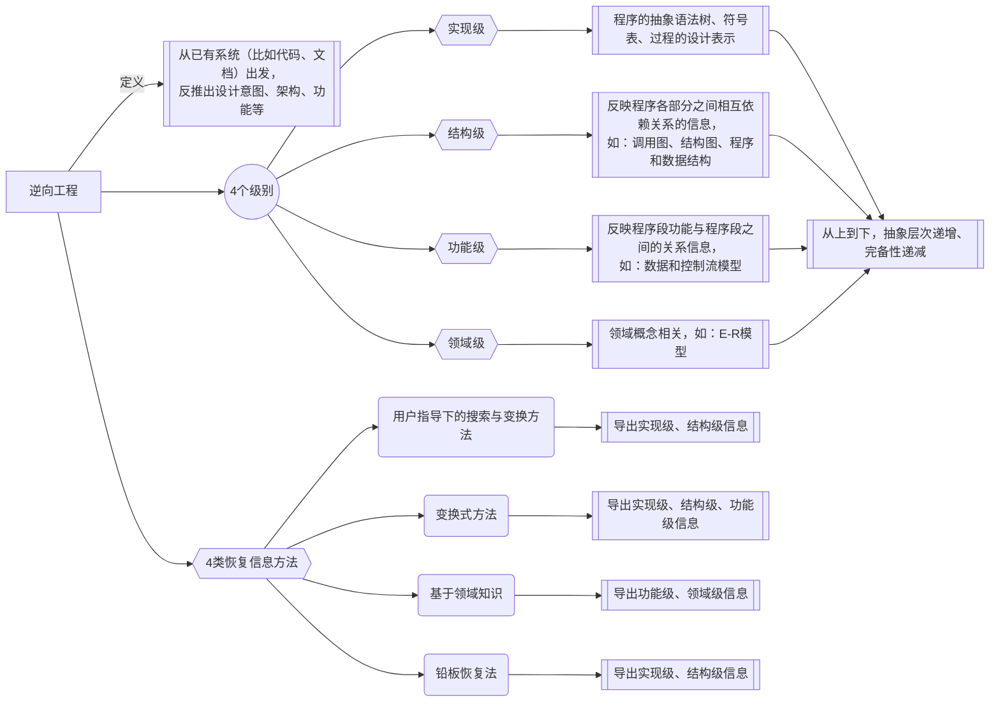

# 逆向工程

```mermaid
flowchart LR
A["逆向工程"]
A-->|定义|A1[["从已有系统（比如代码、文档）出发，
反推出设计意图、架构、功能等"]]
A-->B(("4个级别"))
B-->B1{{"实现级"}}
B1-->B11[["程序的抽象语法树、符号表、过程的设计表示"]]
B-->B2{{"结构级"}}
B2-->B21[["反映程序各部分之间相互依赖关系的信息，
如：调用图、结构图、程序和数据结构"]]
B-->B3{{"功能级"}}
B3-->B31[["反映程序段功能与程序段之间的关系信息，
如：数据和控制流模型"]]
B-->B4{{"领域级"}}
B4-->B41[["领域概念相关，如：E-R模型"]]


B0[["从上到下，抽象层次递增、完备性递减"]]
B11-->B0
B21-->B0
B31-->B0
B41-->B0


A-->C{{"4类恢复信息方法"}}
C-->C1("用户指导下的搜索与变换方法")
C1-->C11[["导出实现级、结构级信息"]]
C-->C2("变换式方法")
C2-->C21[["导出实现级、结构级、功能级信息"]]
C-->C3("基于领域知识")
C3-->C31[["导出功能级、领域级信息"]]
C-->C4("铅板恢复法")
C4-->C41[["导出实现级、结构级信息"]]
```
